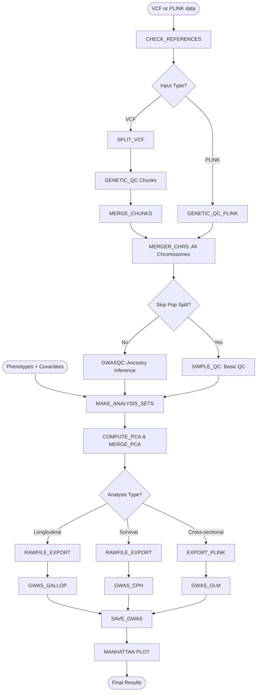

> **Note:**
This repository is under development and may lack certain functionalities. Please refer to the README.md for the latest information.**

# proGWAS pipeline

A Nextflow-based pipeline to perform GWAS with longitudinal capabilities.

## Workflow Overview

This pipeline supports three types of genetic association analyses:
- **Cross-sectional** (GLM): Standard GWAS with single time-point phenotypes
- **Longitudinal** (GALLOP/LMM): Repeated measures analysis with time-varying phenotypes
- **Survival** (Cox PH): Time-to-event analysis

**Pipeline stages:**
```
Input: VCF/PLINK files + Phenotypes + Covariates
  ↓
Stage 1: Genetic QC (filtering, normalization, merging)
  ↓
Stage 2: Data Preparation (sample QC, Analysis set creation, PCA)
  ↓
Stage 3: GWAS Execution (GLM/GALLOP/CPH)
  ↓
Output: Association statistics + Manhattan plots + QQ plots
```

## Quick-start Guide

Overview:
1. Install prerequisites
2. Clone repository 
3. Download references
4. Set environment variables
5. Run example analysis

For a detailed guide and instructions for Verily Workbench set up, please consult the `./docs/vwb_setup.md`.

### 1. Install Prerequisites

- **Nextflow** >= 21.04.0 (DSL2 required) and < 26.04.0
  ```bash
  # Check your version
  nextflow -version
  
  # Install/update Nextflow
  curl -s https://get.nextflow.io | bash
  ```
- **Docker** or **Singularity** (for containerized execution)
  - Docker Desktop (Mac/Windows) or Docker Engine (Linux)
  - OR Singularity/Apptainer (HPC environments)

> **Important (Parser Compatibility):**
> - **If using Nextflow 26.04+**: set parser mode explicitly before running:
>   ```bash
>   export NXF_SYNTAX_PARSER=v1
>   ```


### 2. Clone Repository

```bash
git clone https://github.com/hirotaka-i/progwas-pipeline.git
cd progwas-pipeline
# Update to latest code if needed
git pull origin main  
```

### 3. Reference Folder Setup

The `References/` folder contains reference genome FASTA files and chain files for liftover (to Hg38). They are required to be placed in the directory specified by the `reference_dir` parameter (default: `./References/`) with the following structure. 

```
<reference_dir>/ # Directory specified by `reference_dir` parameter. Default: `./References/`
├── Genome/
│   ├── hg38.fa.gz
│   ├── hg38.fa.gz.fai
│   ├── hg19.fa.gz
│   └── hg19.fa.gz.fai
└── liftOver/
    ├── hg19ToHg38.over.chain.gz
    └── hg18ToHg38.over.chain.gz
```

For example, if your target genotyping data is hg19, you can download required files using the provided script:
```bash
bin/download_references.sh hg19 References
```

### 4. Set environment variables

Create a file with necessary environment variables, which should be loaded before each run using `source ~/.env`. To create the `~/.env` file, use this template:

```bash
cat > ~/.env << 'EOF'
export NXF_SYNTAX_PARSER=v1
export STORE_ROOT='~/longGWAS/test_run' # replace with project directory
export PROJECT_NAME='my_analysis' # name of folder where results are stored (i.e. STORE_ROOT/PROJECT_NAME/)
export REFERENCE_DIR='~/longGWAS/progwas-pipeline-dev/References' # where References are stored
EOF
```

**Note**: If you are using Verily Workbench, can add `export TOWER_ACCESS_TOKEN='your-token'` to monitor your run on Seqera. Consult the `./docs/vwb_setup.md` for more information.

### 5. Run example analysis

This pipeline supports three types of genetic association analyses:
- **Cross-sectional** (GLM): Standard GWAS with single time-point phenotypes
- **Longitudinal** (GALLOP/LMM): Repeated measures analysis with time-varying phenotypes
- **Survival** (Cox PH): Time-to-event analysis

You will find example `.YML` configuration files in the `./example/params_YML` directory.

To run an example **cross-sectional GLM** locally:

```bash
source ~/.env

cd ~/longGWAS/progwas-pipeline-dev

nextflow -log LOG_$(date +%Y%m%d_%H%M%S).log run main.nf \
  -profile standard \
  -params-file ./example/params_YML/test_cs_linear.yml \
  -resume
```

To run the same analysis on Verily Workbench, change the `-profile` flag:

```bash
source ~/.env

cd ~/path/to/progwas-pipeline

wb nextflow -log LOG_$(date +%Y%m%d_%H%M%S).log run main.nf \
  -profile gcb_vwb \
  -params-file ./example/params_YML/test_cs_linear.yml \
  -with-tower -resume
```

For Batch jobs on a plain (non-VWB) GCP project, you may use `-profile gcb_gcp` instead.

For other example scripts and detailed information on parameter specification and .YML file settings, please consult the `./docs/tmp_docs.md` (work in progress).

## Graphic Overview




## Support

For issues and questions:
- 🐛 **Bug reports**: [GitHub Issues](https://github.com/hirotaka-i/long-gwas-pipeline/issues)
- 💬 **Discussions**: [GitHub Discussions](https://github.com/hirotaka-i/long-gwas-pipeline/discussions)
